# ⚡ Hi 👋, I'm Hafiz Alwan Susilo
### `Front-End & Full-Stack Web Developer`

 

<!-- SECTION 1: WHOAMI & NEOFETCH CARD -->
<h3><code>alwan9@github ~ $ whoami</code></h3>

<table>
  <tr>
    <td valign="top" align="center">
      
    </td>
    <td valign="top" align="center">
      
    </td>
  </tr>
</table>

  

<!-- SECTION 2: ABOUT & CURRENT PROJECTS -->
<h3><code>alwan9@github ~ $ cat about.md</code></h3>

  I am a dedicated <b>Front-End Developer</b> who also takes on <b>Full-Stack Developer</b> roles when needed. I have successfully completed various projects, including building cashier applications with Java, developing front-end e-commerce platforms, and creating custom landing pages as requested by clients. My technical skills include proficiency in Figma, Photoshop, Laravel, HTML, CSS, PHP, JavaScript, and MySQL. I am passionate about creating clean, user-friendly interfaces and developing efficient, high-quality web solutions.

<table width="100%">
  <tr>
    <td>
      <ul>
        <li>🔭 <b>Currently Working On</b>: <a href="https://github.com/alwan9/E-commers-Toko-Baju-by-alwan" target="_blank">website BajuBagus Inc</a></li>
        <li>👨‍💻 <b>All Projects</b>: <a href="https://alwan9.github.io/personal/" target="_blank">alwan9.github.io/personal/</a></li>
        <li>📄 <b>Experiences &amp; Resume</b>: <a href="https://alwan9.github.io/personal/" target="_blank">alwan9.github.io/personal/</a></li>
        <li>📫 <b>How to reach me</b>: <a href="mailto:hafizsusilo86@gmail.com">hafizsusilo86@gmail.com</a></li>
      </ul>
    </td>
  </tr>
</table>

  

<!-- SECTION 3: CONTRIBUTION HEATMAP -->
<h3><code>alwan9@github ~ $ ./contributions.sh</code></h3>

  

<!-- SECTION 4: LANGUAGES AND TOOLS -->
<h3><code>alwan9@github ~ $ cat stack.json</code></h3>

  
  &nbsp;
  
  &nbsp;
  
  &nbsp;
  
  &nbsp;
  
  &nbsp;
  
  &nbsp;
  
  &nbsp;
  
  &nbsp;
  
  &nbsp;
  
  &nbsp;
  
  &nbsp;
  
  &nbsp;
  

  

<!-- SECTION 5: GITHUB STATS & METRICS -->
<h3><code>alwan9@github ~ $ ./stats.sh</code></h3>

<table>
  <tr>
    <td valign="top" align="center">
      
    </td>
    <td valign="top" align="center">
      
    </td>
  </tr>
</table>

  

<!-- SECTION 6: CONNECT & SOCIAL CTA -->
<h3><code>alwan9@github ~ $ ./connect.sh</code></h3>

  
  &nbsp;
  
  &nbsp;
  
  &nbsp;
  

 

<i>Terminal README built with animated SVG &amp; SMIL CSS Keyframes 🚀</i>

